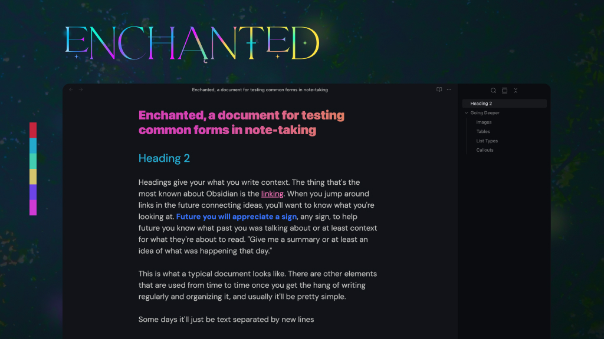
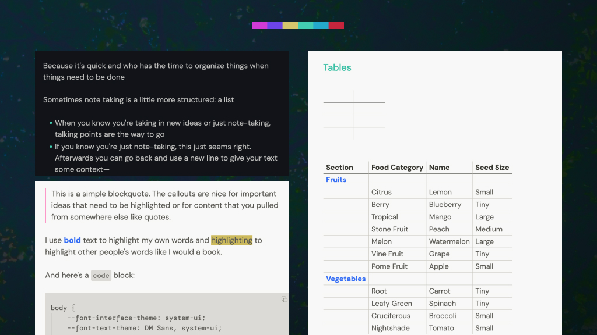

# Enchanted is a color scheme for note-taking.

The purpose is to help with remembering or learning whether notes read again or not. It's vibrant and points to things when one highlights a book or document passage.

If one *does* come back to read the notes, helpful notes are not necessarily well structured but having parts and passages pointed out and sectioned helps a lot in making structure (if you're trying to do something or trying to learning from the notes).

In the context of a desktop screen, notes are a different place from browser windows and code windows (if one does that). Browser windows are a mess, there's not much to do about that. For code or command line windows, Solarized or similar themes are everywhere on my particular screen and it's important to be able to switch quickly when searching through window. Notes need to be their own place at least visually. So this is what Enchanted is for, it's a sense of place, different from the other windows that need to be there in life.

Hierarchy of colors in general:
Pink, marine, mint, yellow, purple, rose

It's work in progress and starts as a color scheme for **descriptive note-taking** which takes some lessons from coding.

1. Structure is important for readability and navigation for later when it makes less sense than when you first wrote it.
2. Documentation/comments makes the intention more clear when content and structure isn't enough.

Less important design details
- Image corners are softened
- Tables are lightweight and only show the outer border on hover.
- Comments are very well implemented in Obsidian's flavor of markdown. I could write for a long time about it but an important part of note-taking is that you can make notes for your notes, like writing on the margins of a page to explain a concept further. In notes you can callout or highlight things, but some things are less than the the main content. Callouts, highlights, bolding text makes text more important, comments go the other direction.

Side notes on the screenshots:

For my own personal use, I have DM Sans, DM Mono, and SF Pro Display installed. You don't need them but you can download them for free from their respected places. JetBrains Mono is a fallback for monospace text.
